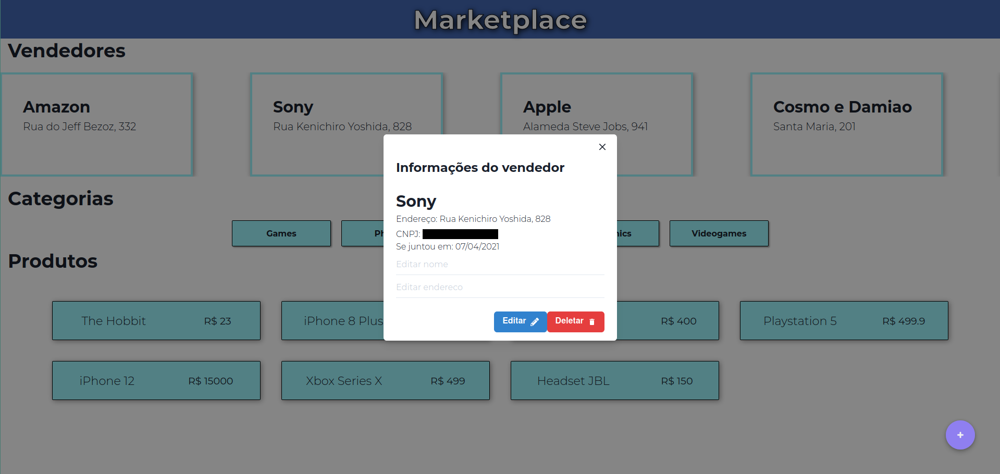

# GoLedger Challenge

## Informações sobre o projeto

O projeto foi desenvolvido utilizando o framework ReactJS. Com auxílio da biblioteca de estilização [Chakra-UI](https://chakra-ui.com/)

Para execução do projeto é necessário executar: 
```bash
  yarn install
```
dentro da pasta `marketplace` e assim que todas as dependências forem instaladas executar:
```bash
  yarn start
```

O projeto entrará em execução no endereço `http://localhost:3000`.

## Screenshots




